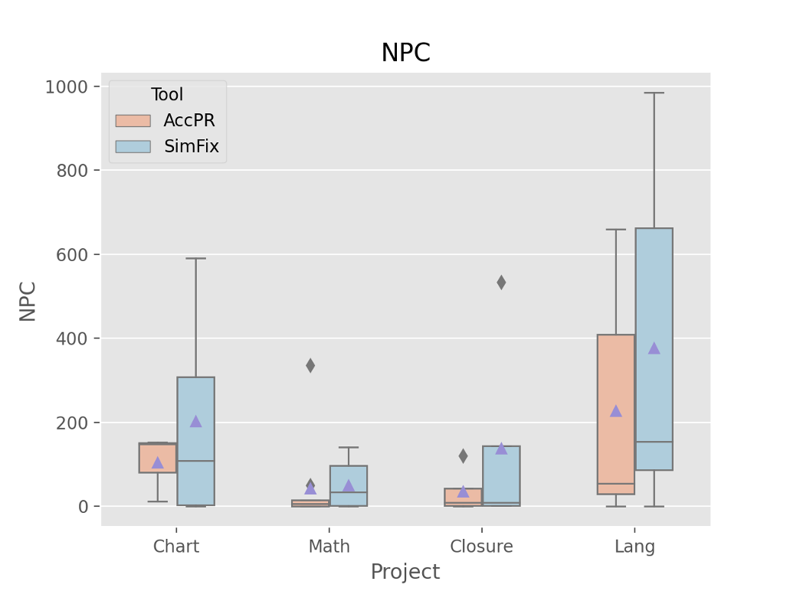

# AccPR

AccPR is an automated program repair accelerating approach, which leverages code representation to measure code similarity and employs adaptive patch filtering to accelerate redundancy-based APR techniques. The following figure is the workflow of our approach.

## Similarity Measurement

- Code Representation. 

  We incorporate ASTNN, a code representation model that can effectively extract semantic information of code snippets in AccPR. It is suitable to our scenario since it is a general-purpose model that is not limited to any specific tasks.

- Similarity Measurement. 

  We apply learned embeddings to capture the similarity between code snippets. Given two code snip- pets 𝑚 and 𝑛, we first leverage ASTNN to embed them into vectors, and then employ 1-Norm to compute their similarity, which is definedas: 𝑆𝑖𝑚𝑖(𝑚,𝑛) = ||𝑎𝑠𝑡𝑛𝑛(𝑚)−𝑎𝑠𝑡𝑛𝑛(𝑛)||, where𝑎𝑠𝑡𝑛𝑛(∗) refers to the embedding result of the given code snippet.

- Candidate Code Snippets Ranking. 

  Given a suspicious faulty code snippet 𝑛, AccPR identifies a set of similar code snippets M as candidates for patch generation. That is, for each 𝑚 ∈ M, we compute its similarity with 𝑛 by 𝑆𝑖𝑚𝑖 (𝑛, 𝑚). Then, AccPR ranks all candidate code snippets as the descending order of these similarity results, since the code snippets having higher similarities with the faulty code are more likely to generate the correct patch

## Adaptive Patch Filtering

Given a set of similar code snippets, multiple patches P shall be generated for a faulty snippet 𝑛, then AccPR performs a multi-level patch prioritization and filtering strategy according to the following rules to make the correct patch be validated as early as possible.

- R1 (Similarity): Patches that have higher similarities with the faulty code (i.e., 𝑆𝑖𝑚𝑖 (𝑝, 𝑛) for each 𝑝 ∈ P) are ranked higher since patches are usually simple.

- R2 (Adaptive Filtering): Patches that are similar to a known incorrect patch under a given threshold will be filtered since they are highly likely to be incorrect as well.

R1 is inspired by syntactic distance proposed by Mechtaev et al. [10, 16], while R2 targets to filter out potential incorrect patches as early as possible with similar inconsequential modifications. AccPR validates patches according to the candidate patch list, which is adaptively updated by applying the above two strategies online.

## Environment

* OS: Linux (Tested on Ubuntu 7.5.0)
* JDK: Oracle jdk1.8 (**important!**)
* Download and configure Defects4J (**branch  [fee5ddf020](https://github.com/rjust/defects4j/tree/fee5ddf020d0ce9c793655b74f0ab068153c03ef)**) running environment.
* Configure the following path.
  * DEFECTS4J_HOME="home_of_defects4j"

## Running options

* `--proj_home ` : the home of buggy program of benchmark. (`${buggy_program_path}` for the example)

* `--proj_name` : the project name of buggy program of benchmark. (`chart` for the example)

* `--bug_id` : the identifier of the buggy program. (`1` for the example)

  * The option of `--bugy_id` supports multiple formats:

    `single_id` : repair single bug, `e.g., 1`.

    `startId-endId` : repair a series of bugs with consecutive identifiers, `e.g., 1-3`.

    `single_id,single_id,single_id` : repair any bugs for the specific program, `e.g., 1,5,9`.

    `all` : repair all buggy versions of a specific project, `i.e., all`.

## Evaluation Result

The average repair time is reduced from 11.34 to 5.91 minutes, achieving 47.85% repair time reduction on average. Futhermore, the number of candidate patches is also significantly reduced by 46.48% on average. 

|  |  |
| :----------------------------------------------------------: | :----------------------------------------------------------: |
|                          Time Cost                           |                             NPC                              |

<u>__ALL__ suggestions are welcomed.</u>

